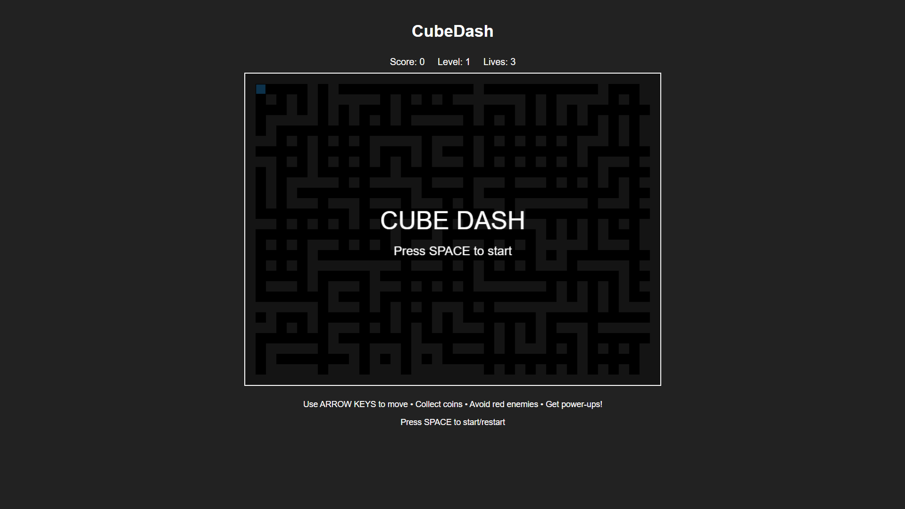
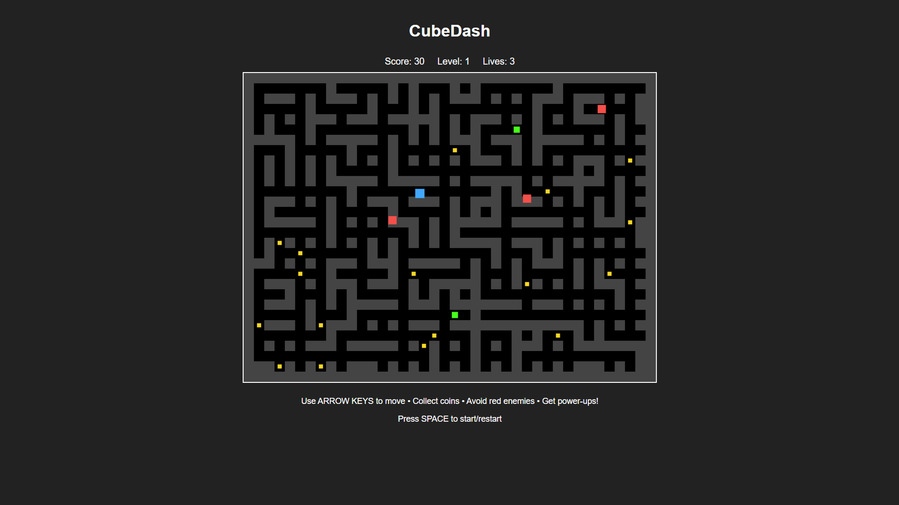
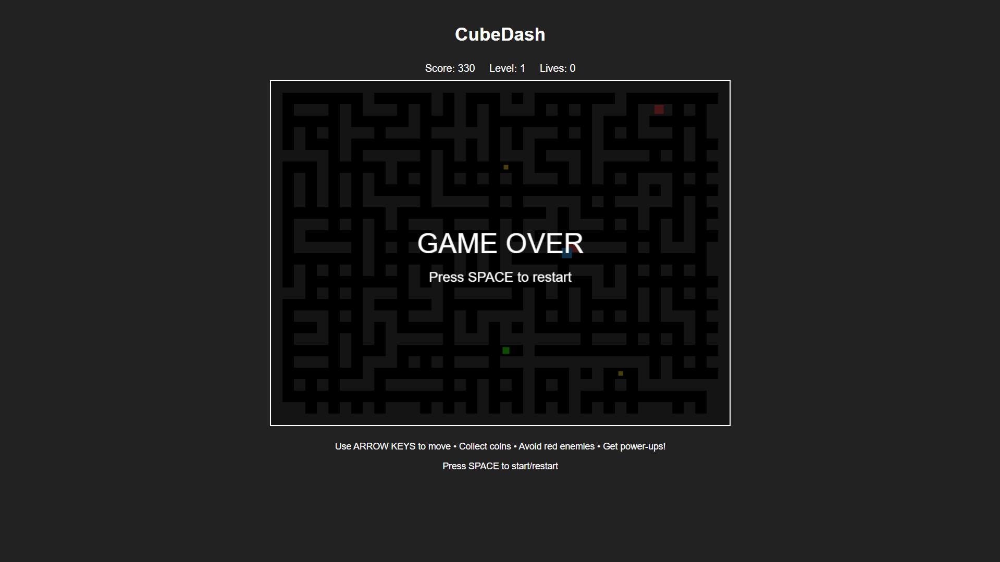

# CubeDash

Um jogo web de labirinto estilo arcade onde você controla um cubo coletando itens e evitando inimigos.

## 🎮 Principais Funcionalidades

### Jogabilidade Core
- **Movimento em 4 direções**: Use as setas do teclado para mover o cubo azul
- **Sistema de labirinto**: Navegue por labirintos gerados proceduralmente
- **Coleta de itens**: Colete moedas douradas espalhadas pelo labirinto (10 pontos cada)
- **Power-ups**: Pegue quadrados verdes para ficar invencível por 5 segundos (50 pontos)

### Sistema de Inimigos
- **IA básica**: Inimigos vermelhos que perseguem o jogador
- **Detecção de colisão**: Perde vida ao tocar inimigos
- **Modo invencível**: Derrote inimigos durante power-ups (100 pontos cada)

### Progressão
- **Múltiplos níveis**: Dificuldade crescente com mais inimigos e itens
- **Sistema de vidas**: 3 vidas, respawn no início ao ser atingido
- **Pontuação**: Score baseado em itens coletados e inimigos derrotados
- **Progressão automática**: Avança de nível ao coletar todas as moedas

## 📸 Screenshots

### Tela Inicial

*Tela de início do jogo*

### Gameplay

*Jogador (azul) coletando moedas (dourado) e evitando inimigos (vermelho)*

### Power-up Ativo

*Jogador invencível (amarelo) com inimigos vulneráveis (azul)*

### Game Over

*Tela de fim de jogo*

## 🏗️ Arquitetura do Projeto

```
awsman/
├── index.html          # Interface principal do jogo
├── game.js            # Lógica completa do jogo
├── README.md          # Documentação do projeto
└── screenshots/       # Capturas de tela do jogo
    ├── start-screen.png
    ├── gameplay.png
    ├── powerup.png
    └── game-over.png
```

### Estrutura do Código

#### `index.html`
- Interface HTML5 com Canvas
- UI para pontuação, nível e vidas
- Instruções de controle
- Estilos CSS integrados

#### `game.js`
```javascript
class Game {
    // Componentes principais:
    ├── constructor()          # Inicialização do jogo
    ├── generateMaze()         # Geração procedural do labirinto
    ├── updatePlayer()         # Controles e movimento do jogador
    ├── updateEnemies()        # IA e movimento dos inimigos
    ├── checkCollisions()      # Sistema de colisões
    ├── spawnItems()           # Geração de moedas e power-ups
    ├── render()               # Renderização gráfica
    └── gameLoop()             # Loop principal do jogo
}
```

### Fluxo de Execução
1. **Inicialização**: Criação do canvas e configuração inicial
2. **Geração**: Criação procedural do labirinto e spawn de itens/inimigos
3. **Loop Principal**: 
   - Captura de input do jogador
   - Atualização de posições (jogador + inimigos)
   - Verificação de colisões
   - Renderização do frame
   - Verificação de condições de vitória/derrota

### Tecnologias Utilizadas
- **HTML5 Canvas**: Renderização gráfica 2D
- **JavaScript ES6**: Lógica do jogo e orientação a objetos
- **CSS3**: Estilização da interface
- **RequestAnimationFrame**: Loop de jogo suave

## 🚀 Como Executar

1. Clone o repositório
2. Execute um servidor HTTP local:
   ```bash
   python3 -m http.server 3000
   ```
3. Abra `http://localhost:3000` no navegador
4. Pressione ESPAÇO para iniciar o jogo

## 🧪 Testes Automatizados

### Executar Testes
```bash
npm test
# ou
python3 -m http.server 8080
# Abra http://localhost:8080/test-runner.html
```

### Tipos de Teste
- **Testes Unitários**: Validam componentes individuais
- **Testes de Integração**: Verificam interação entre sistemas
- **Testes E2E**: Simulam fluxos completos do jogo
- **Testes de Performance**: Medem eficiência do game loop

### Cobertura de Testes
- ✅ Inicialização do jogo
- ✅ Geração de labirinto
- ✅ Movimento do jogador
- ✅ Sistema de colisões
- ✅ Coleta de itens e power-ups
- ✅ Comportamento de inimigos
- ✅ Progressão de níveis
- ✅ Condições de game over
- ✅ Fluxo completo do jogo

## 🎯 Controles

- **Setas**: Movimento do cubo
- **ESPAÇO**: Iniciar/Reiniciar jogo

## 🏆 Sistema de Pontuação

| Item | Pontos |
|------|--------|
| Moeda | 10 |
| Power-up | 50 |
| Inimigo derrotado | 100 |
